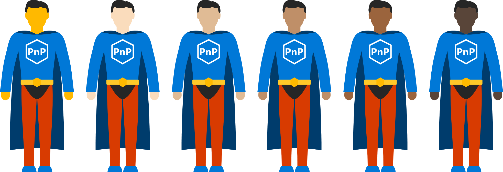
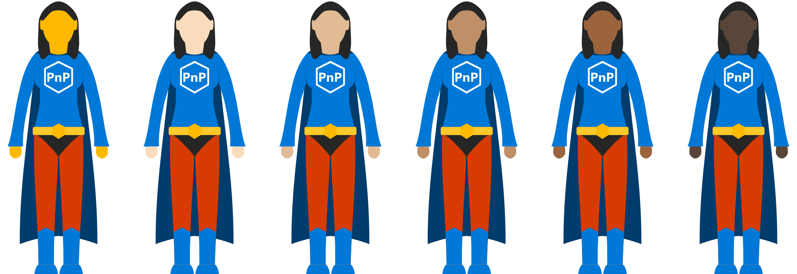
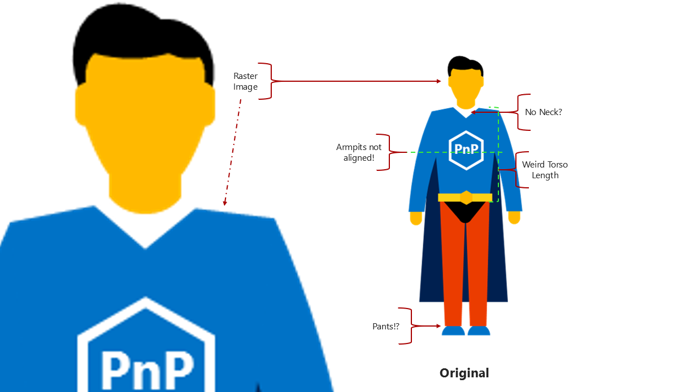

# PnPHero SVG

Scalable vector graphic versions of the SharePoint Patterns and Practices (PnP) super heroes.

There are Male and Female versions that come in 6 skin tones: Original, Light, Medium-Light, Medium, Medium-Dark, and Dark. These tones (and the colors for these tones) were modeled after the set of emojis produced by Apple.

## Using the files

There is a Master SVG file that contains all of the layers (this is the file to edit if you want to contribute), but there are also individual SVG files and PNG files available of each iteration for quick and easy use.

**These files can be freely used for anything (PnP related or not) with no attribution required.**

## Why?

Originally, the PnP Hero was a raster graphic with several issues that were driving me nuts:

You can read more about this [here](https://thechriskent.com/2017/11/01/the-pnp-super-hero-we-need/).

Later it was requested that the Hero be more inclusive so Female and multiple skin tone versions were added. You can read more about this here.

## I don't like it!!!

Then download Inkscape (a free vector editor) and make the changes and submit a pull request. I'd love to have the contributions of those with more talent/ideas. Thanks in advance!
